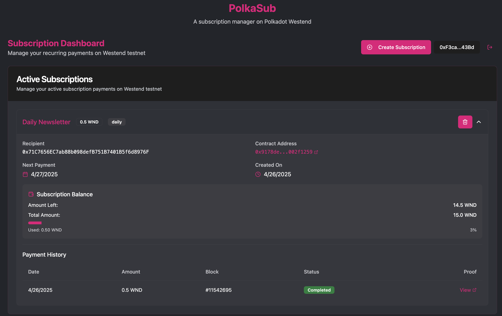
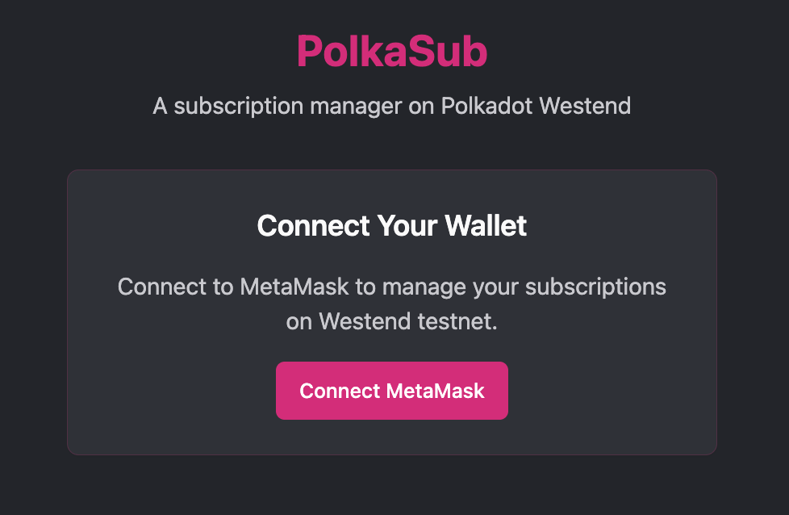
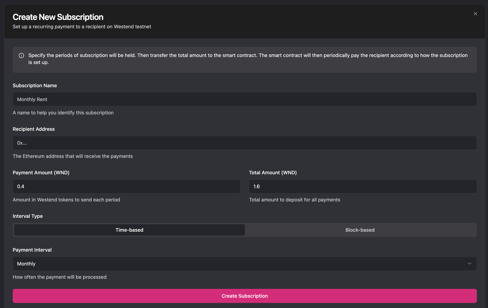

# PolkaSub - A Subscription Manager on Polkadot Westend

A subscription management system built on the Polkadot Westend Asset Hub testnet.

## Demo

### Video demo: 
Presentation:
https://www.loom.com/share/7abb1d115cb448d59292ff0a16ccc0ce?sid=82d11bbf-aa8d-4ae0-b046-9ebaf0cb79c2

Live demo:
https://www.loom.com/share/18f0fa1686b04e17bc8312bea70ee96e?sid=c41504c0-daa0-4532-b24f-42246e5da9c8


### Screenshots of the frontend:




### Canvas presentation link:
https://www.canva.com/design/DAGl1CHQT-w/7DdAlb1r3PYss-N1VcxO2g/edit?utm_content=DAGl1CHQT-w&utm_campaign=designshare&utm_medium=link2&utm_source=sharebutton

## Features

### Frontend
- Built with typescript and nextjs
- Metamask for wallet connection
- UI:
  - View active subscriptions
  - Create new subscriptions
  - Check payment history and progress
  - Cancel subscriptions

### Smart Contract (Solidity)
- Manages subscription agreements
- Collects and transfers payments
- Tracks subscription status (Active, Cancelled, Expired)
- block explorer link (asset hub westend subscan):
    https://assethub-westend.subscan.io/account/0x455aaFbD12cAeF26858ecd72c87f944Ce1f04d64


## Project Structure

- `/contract` - Hardhat project with Solidity smart contracts for subscription management
- `/frontend` - Next.js frontend application

## Setup and Installation

1. Navigate to the frontend directory:
   ```bash
   cd frontend
   ```

2. Install dependencies:
   ```bash
   npm install --legacy-peer-deps
   ```

3. Start the development server:
   ```bash
   npx next build
   ```
   ```bash
   npx next dev
   ```

4. Access the application at http://localhost:3000


## Important notes for users
- Make sure your wallet is on the Westend Asset Hub network (chainId: 420420421)
- Fund your deployer's account with some test WND

## Important notes for hackathon
- Parts of the current integration with frontend and smart contract are still in development, not all features are working as intended.

## Future Improvements
- Ability to delete a subscription
- Deploy to mainnet
- Make frontend prettier
- Fix bugs in function calls